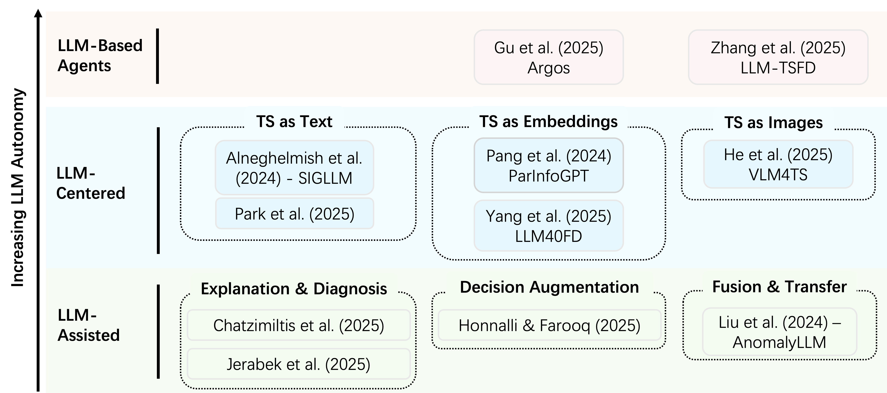
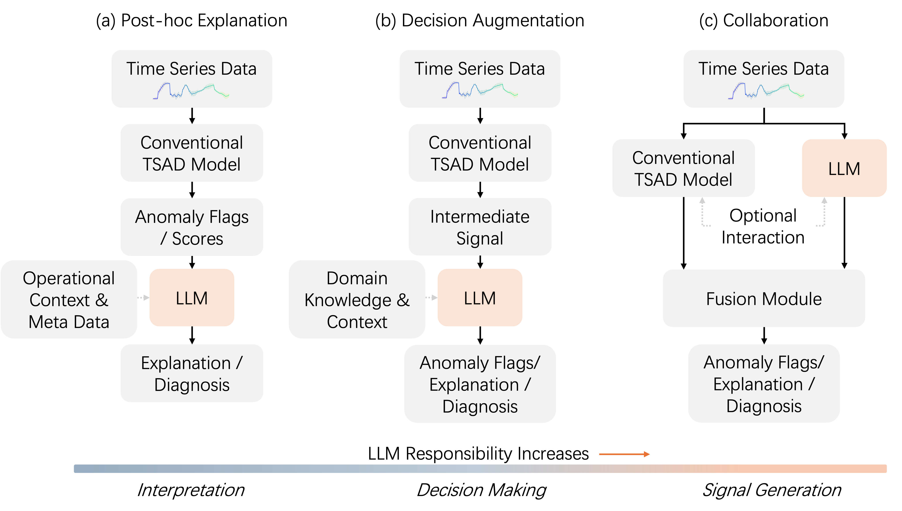
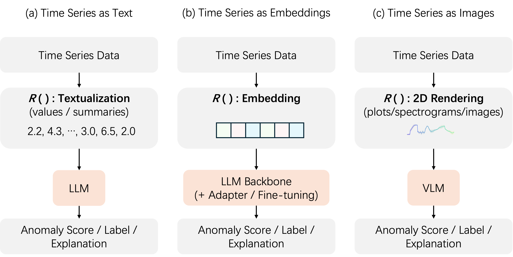

# A Survey of Large Language Models for Time Series Anomaly Detection (LLM4TSAD)
> Supplementary resource repository for our survey on LLM-based time series anomaly detection.

This repository serves as a structured resource index for our survey on **Large Language Models for Time Series Anomaly Detection (TSAD)**, providing direct access to reviewed papers (with DOI links) and a taxonomy organized by the **functional role of the LLM**: *LLM-Assisted*, *LLM-Centered*, and *Agentic* TSAD.

---

## 📄 Survey Paper

**Title**: A Survey of Large Language Models for Time Series Anomaly Detection: Methods, Challenges, and Future Directions  
**Authors**: Kunqi Li, Thomas Pitts, Bin Liang, Chenya Huang, Yuxi Lu  
**Date**: January 07, 2026  
**Links**: 📖 [SSRN](https://ssrn.com/abstract=6033215) | 🔗 [DOI](https://doi.org/10.2139/ssrn.6033215)

---

## Table of Contents

- [📄 Survey Paper](#-survey-paper)
- [📊 Survey Figures](#-survey-figures)
- [📝 Literature Overview](#-literature-overview)
- [📈 Star History](#-star-history)
- [📚 Research Papers](#-research-papers)
  - [1️⃣ LLM-Assisted Anomaly Detection Methods](#1️⃣-llm-assisted-anomaly-detection-methods)
  - [2️⃣ LLM-Centered Anomaly Detection Methods](#2️⃣-llm-centered-anomaly-detection-methods)
  - [3️⃣ LLM-Based Anomaly Detection Agents](#3️⃣-llm-based-anomaly-detection-agents)
- [📑 Citation & Usage](#-citation--usage)
- [📄 License](#-license)

---

## 📊 Survey Figures

<p align="center">
  
</p>

**Figure 1**: Taxonomy of LLM-based TSAD methods by the functional role of the LLM.

<details>
<summary><b>📈 Click to view additional survey figures</b></summary>

### Method Pipelines
<p align="center">
  
</p>

<p align="center">
  
</p>

</details>

---

## 📈 Star History

<p align="center">
  <a href="https://star-history.com/#YOUR_GITHUB_USERNAME/YOUR_REPO_NAME&Date">
    
  </a>
</p>

---

# 📚 Research Papers

## 1️⃣ LLM-Assisted Anomaly Detection Methods

### 1.1 LLM-Assisted Anomaly Explanation and Diagnosis

<details>
<summary><b>[2025] AI-on-RAN for Cyber Defense: An XAI-LLM Framework for Interpretable Anomaly Detection</b></summary>

- **Authors**: Chatzimiltis, Sotiris; Shojafar, Mohammad; Mashhadi, Mahdi Boloursaz; Tafazolli, Rahim  
- **Venue**: IEEE Transactions on Network Science and Engineering  
- **Links**: 📖 https://doi.org/10.1109/TNSE.2025.3629983  
</details>

<details>
<summary><b>[2025] Explainable Anomaly Detection in Network Traffic Using LLM</b></summary>

- **Authors**: Jerabek, Kamil; Koumar, Josef; Setinský, Jiří; Pesek, Jaroslav  
- **Venue**: NOMS 2025 (IEEE Network Operations and Management Symposium)  
- **Links**: 📖 https://doi.org/10.1109/NOMS57970.2025.11073574  
</details>

---

### 1.2 LLM-Assisted Decision Augmentation

<details>
<summary><b>[2025] Multimodal LLM-Guided Sequential Detection of Cyber Threats in Electric Vehicle Charging Systems</b></summary>

- **Authors**: Honnalli, Ritesh; Farooq, Junaid  
- **Venue**: IEEE COINS 2025  
- **Links**: 📖 https://doi.org/10.1109/COINS65080.2025.11125732  
</details>

<details>
<summary><b>[2025] Cluster-LLM: Adaptive Real-Time Time-Series Anomaly Detection Using LLMs</b></summary>

- **Authors**: Zhu, Binbin; Xiong, Gang; Yuan, Meng; Shen, Zhen; Zhu, Fenghua; Chen, Shichao; Dong, Xisong; Liu, Sheng; Chen, Junrui  
- **Venue**: IEEE CSIS-IAC 2025  
- **Links**: 📖 https://doi.org/10.1109/CSIS-IAC65538.2025.11161558  
</details>

---

### 1.3 LLM-Assisted Collaboration via Fusion or Representation Transfer

<details>
<summary><b>[2025] Synergizing Large Language Models and Task-specific Models for Time Series Anomaly Detection</b></summary>

- **Authors**: Chen, Feiyi; Zhang, Leilei; Pang, Guansong; Zimmermann, Roger; Deng, Shuiguang  
- **Venue**: arXiv  
- **Links**: 📖 https://doi.org/10.48550/ARXIV.2501.05675  
</details>

<details>
<summary><b>[2024] Large Language Model Guided Knowledge Distillation for Time Series Anomaly Detection</b></summary>

- **Authors**: Liu, Chen; He, Shibo; Zhou, Qihang; Li, Shizhong; Meng, Wenchao  
- **Venue**: IJCAI 2024  
- **Links**: 📖 DOI: TBA  
</details>

---

## 2️⃣ LLM-Centered Anomaly Detection Methods

### 2.1 Time Series as Text

<details>
<summary><b>[2024] AAD-LLM: Adaptive Anomaly Detection Using Large Language Models</b></summary>

- **Authors**: Russell-Gilbert, Alicia; Sommers, Alexander; Thompson, Andrew; Cummins, Logan; Mittal, Sudip; Rahimi, Shahram; Seale, Maria; Jaboure, Joseph; Arnold, Thomas; Church, Joshua  
- **Venue**: IEEE BigData 2024  
- **Links**: 📖 https://doi.org/10.1109/BigData62323.2024.10825679  
</details>

<details>
<summary><b>[2024] Can Large Language Models Be Anomaly Detectors for Time Series?</b></summary>

- **Authors**: Alnegheimish, Sarah; Nguyen, Linh; Berti-Equille, Laure; Veeramachaneni, Kalyan  
- **Venue**: IEEE DSAA 2024  
- **Links**: 📖 https://doi.org/10.1109/DSAA61799.2024.10722786  
</details>

<details>
<summary><b>[2025] Large Language Models Can Deliver Accurate and Interpretable Time Series Anomaly Detection</b></summary>

- **Authors**: Liu, Jun; Zhang, Chaoyun; Qian, Jiaxu; Ma, Minghua; Qin, Si; Bansal, Chetan; Lin, Qingwei; Rajmohan, Saravan; Zhang, Dongmei  
- **Venue**: ACM SIGKDD 2025 (Proceedings of the 31st ACM SIGKDD)  
- **Links**: 📖 https://doi.org/10.1145/3711896.3737239  
</details>

<details>
<summary><b>[2025] Anomaly Detection Using Generative Language Models and Deep Feature-Based Time Series Similarity</b></summary>

- **Authors**: Lee, Junpyo; Choi, Jungmu; Min Park, Jung; Lim, Yong-Jae; Jung, Hae-Jin; Kang, Soyoung; An, Chanjung; Kwon, Jangwoo  
- **Venue**: IEEE Access  
- **Links**: 📖 https://doi.org/10.1109/ACCESS.2025.3604216  
</details>

---

### 2.2 Time Series as Embeddings

<details>
<summary><b>[2025] LLM-Based Fault Detection in Connected Vehicle Time-Series Data</b></summary>

- **Authors**: Das, Rakesh; Griffith, Henry; Rathore, Heena  
- **Venue**: ACM SAT-CPS 2025  
- **Links**: 📖 https://doi.org/10.1145/3716816.3727968  
</details>

<details>
<summary><b>[2024] Multivariate Time Series Anomaly Detection Based on Pre-Trained Models with Dual-Attention Mechanism</b></summary>

- **Authors**: Sun, Yongqian; Guo, Yang; Liang, Minghan; Wen, Xidao; Kuang, Junhua; Zhang, Shenglin; Li, Hongbo; Xia, Kaixu; Pei, Dan  
- **Venue**: ISSREW 2024  
- **Links**: 📖 https://doi.org/10.1109/ISSREW63542.2024.00050  
</details>

<details>
<summary><b>[2024] Leveraging LLMs for Multimodal Medical Time Series Analysis</b></summary>

- **Authors**: Chan, Nimeesha; Parker, Felix; Bennett, William; Wu, Tianyi; Jia, Mung Yao; Fackler, James; Ghobadi, Kimia  
- **Venue**: MLHC (arXiv preprint)  
- **Links**: 📖 https://doi.org/10.48550/arXiv.2408.07773  
</details>

<details>
<summary><b>[2025] LLM-based Framework for Bearing Fault Diagnosis</b></summary>

- **Authors**: Tao, Laifa; Liu, Haifei; Ning, Guoao; Cao, Wenyan; Huang, Bohao; Lu, Chen  
- **Venue**: Mechanical Systems and Signal Processing  
- **Links**: 📖 https://doi.org/10.1016/j.ymssp.2024.112127  
</details>

<details>
<summary><b>[2025] TriP-LLM: A Tri-Branch Patch-Wise Large Language Model Framework for Time-Series Anomaly Detection</b></summary>

- **Authors**: Yu, Yuan-Cheng; Ouyang, Yen-Chieh; Lin, Chun-An  
- **Venue**: IEEE Access  
- **Links**: 📖 https://doi.org/10.1109/ACCESS.2025.3613663  
</details>

<details>
<summary><b>[2025] FD-LLM: Large Language Model for Fault Diagnosis of Complex Equipment</b></summary>

- **Authors**: Lin, Lin; Zhang, Sihao; Fu, Song; Liu, Yikun  
- **Venue**: Advanced Engineering Informatics  
- **Links**: 📖 https://doi.org/10.1016/j.aei.2025.103208  
</details>

<details>
<summary><b>[2024] ParInfoGPT: An LLM-based Two-Stage Framework for Reliability Assessment of Rotating Machine under Partial Information</b></summary>

- **Authors**: Pang, Zhendong; Luan, Yingxin; Chen, Jiahong; Li, Teng  
- **Venue**: Reliability Engineering & System Safety  
- **Links**: 📖 https://doi.org/10.1016/j.ress.2024.110312  
</details>

<details>
<summary><b>[2025] MADLLM: Multivariate Anomaly Detection via Pre-trained LLMs</b></summary>

- **Authors**: Tao, Wei; Qu, Xiaoyang; Lu, Kai; Wan, Jiguang; Li, Guokuan; Wang, Jianzong  
- **Venue**: IEEE ICME 2025  
- **Links**: 📖 https://doi.org/10.1109/ICME59968.2025.11209795  
</details>

<details>
<summary><b>[2025] LLM40FD: Unlocking the Potential of LLM for Anonymous Zero-Shot Fraud Detection</b></summary>

- **Authors**: Yang, Kaixiang; Zhong, Zhijie; Sun, Song; Yu, Zhiwen; Chen, C. L. Philip; Zhang, Tong  
- **Venue**: IEEE Transactions on Computational Social Systems  
- **Links**: 📖 https://doi.org/10.1109/TCSS.2025.3563954  
</details>

---

### 2.3 Time Series as Images

<details>
<summary><b>[TBA] Delving into Large Language Models for Effective Time-Series...</b></summary>

- **Authors**: Park, Junwoo; Jung, Kyudan; Lee, Dohyun; Lee, Hyuck; Gwak, Daehoon; Park, ChaeHun; Choo, Jaegul; Cho, Jaewoong  
- **Venue**: TBA  
- **Links**: 📖 DOI: TBA  
</details>

<details>
<summary><b>[2025] Time-RA: Towards Time Series Reasoning for Anomaly with LLM Feedback</b></summary>

- **Authors**: Yang, Yiyuan; Liu, Zichuan; Song, Lei; Ying, Kai; Wang, Zhiguang; Bamford, Tom; Vyetrenko, Svitlana; Bian, Jiang; Wen, Qingsong  
- **Venue**: arXiv  
- **Links**: 📖 https://doi.org/10.48550/arXiv.2507.15066  
</details>

<details>
<summary><b>[2025] T2MFDF: An LLM-enhanced Multimodal Fault Diagnosis Framework Integrating Time-Series and Textual Data</b></summary>

- **Authors**: Zhou, Jiajing; Guo, Yuanjun; Yang, Zhile; Yang, Jinning; An, Zhao; Li, Kang; McLoone, Sean  
- **Venue**: IEEE Transactions on Instrumentation and Measurement  
- **Links**: 📖 https://doi.org/10.1109/TIM.2025.3583374  
</details>

<details>
<summary><b>[2025] Harnessing Vision-Language Models for Time Series Anomaly Detection</b></summary>

- **Authors**: He, Zelin; Alnegheimish, Sarah; Reimherr, Matthew  
- **Venue**: arXiv  
- **Links**: 📖 https://doi.org/10.48550/arXiv.2506.06836  
</details>

<details>
<summary><b>[2025] Can LLMs Understand Time Series Anomalies?</b></summary>

- **Authors**: Zhou, Zihao; Yu, Rose  
- **Venue**: ICLR (arXiv)  
- **Links**: 📖 https://doi.org/10.48550/arXiv.2410.05440  
</details>

---

## 3️⃣ LLM-Based Anomaly Detection Agents

<details>
<summary><b>[2025] Argos: Agentic Time-Series Anomaly Detection with Autonomous Rule Generation via Large Language Models</b></summary>

- **Authors**: Gu, Yile; Xiong, Yifan; Mace, Jonathan; Jiang, Yuting; Hu, Yigong; Kasikci, Baris; Cheng, Peng  
- **Venue**: arXiv  
- **Links**: 📖 https://doi.org/10.48550/arXiv.2501.14170  
</details>

<details>
<summary><b>[2026] Large-Model-Based Smart Agent for Time Series Anomaly Detection in Power Systems</b></summary>

- **Authors**: Wang, Bingrui; Zhou, Yuan; Ge, Leijiao; Kung, Sun-Yuan  
- **Venue**: Expert Systems with Applications  
- **Links**: 📖 https://doi.org/10.1016/j.eswa.2025.128917  
</details>

<details>
<summary><b>[2025] LLM-TSFD: An Industrial Time Series Human-in-the-Loop Fault Diagnosis Method Based on a Large Language Model</b></summary>

- **Authors**: Zhang, Qi; Xu, Chao; Li, Jie; Sun, Yicheng; Bao, Jinsong; Zhang, Dan  
- **Venue**: Expert Systems with Applications  
- **Links**: 📖 https://doi.org/10.1016/j.eswa.2024.125861  
</details>

---

## 📑 Citation & Usage

### How to Cite This Repository

If you use this repository or find it helpful, please cite our survey:

```bibtex
@article{li2026llm4tsad,
  title   = {A Survey of Large Language Models for Time Series Anomaly Detection: Methods, Challenges, and Future Directions},
  author  = {Li, Kunqi and Pitts, Thomas and Liang, Bin and Huang, Chenya and Lu, Yuxi},
  year    = {2026},
  note    = {Available at SSRN},
  doi     = {10.2139/ssrn.6033215},
  url     = {https://ssrn.com/abstract=6033215}
}
